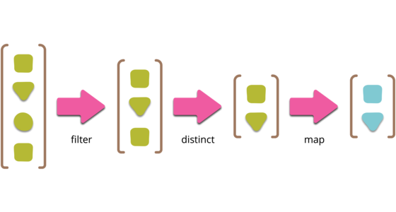

# Pipeline: Makes your sequential process powerful

Allows processing of data in a series of stages by giving in an initial input and passing the processed output to be used by the next stages

Wikipedia Says
-------
In software engineering, a pipeline consists of a chain of processing elements (processes, threads, coroutines, functions, etc.), arranged so that the output of each element is the input of the next; the name is by analogy to a physical pipeline.
How it works. The Pipeline pattern uses ordered stages to process a sequence of input values. Each implemented task is represented by a stage of the pipeline. You can think of pipelines as similar to assembly lines in a factory, where each item in the assembly line is constructed in stages. The partially assembled item is passed from one assembly stage to another. The outputs of the assembly line occur in the same order as that of the inputs.

⬇️ Let me describe with an example
------

Suppose we have a list of cars which each car have color, brand, model & price attributes

Then we want to create the below sequential process:

- step 1: Filter red cars
- step 2: Remove duplicated cars by model
- step 3: Increase benz cars price by 10%
- step 4: Show the result in console

With pipeline pattern you can simply do this process easy. The point is you can add new stages, separate each stage with others and also you can swap the steps together without breaking others.

 Projects using pipeline
 ------
 - java.util.Stream
 - Maven Build Lifecycle
 - Functional Java
 
 Applicability
 ------
 - Execute individual stages that yields a final value.  
 - Add readability to complex sequence of operations by providing a fluent builder as an interface.  
 - Improve testability of code since stages will most likely be doing a single thing, complying to the Single Responsibility Principle(SRP)
 
 Alternative Design Patterns
 ------
 - Chain of responsibility
 
 Source
 ------
  - [Kudvenkat youtube tutorial](https://www.youtube.com/watch?v=rI4kdGLaUiQ&list=PL6n9fhu94yhUbctIoxoVTrklN3LMwTCmd)
  - [Derek Banas youtube tutorial](https://www.youtube.com/watch?v=vNHpsC5ng_E&list=PLF206E906175C7E07)
  - [Java-design-patterns.com](https://java-design-patterns.com/patterns/)
  - [Refactoring.guru](https://refactoring.guru/design-patterns/)
  
  Sponsor
  -------
  ### If you like and use it, please tap the Star(⭐️) button at the above.  
  This source code is free for all; hence, it's not profitable. You can make me happy by donating me :)
  
  
  
  
  
  
  License
  -------
  Copyright (C) 2021 Mehdi Janbarari  
  The source code can be used according to the [Apache License, Version 2.0](LICENSE).